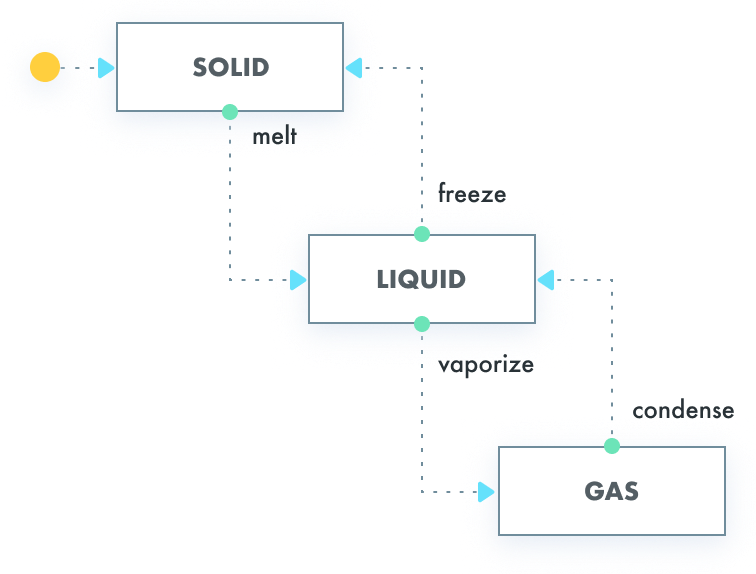

# StateMachine

A Kotlin library for finite state machines.

### Usage

In this example, we create a `StateMachine` from the following state diagram.



Define states:
~~~kotlin
sealed class State {
    object Solid : State()
    object Liquid : State()
    object Gas : State()
}

sealed class Event {
    object OnMelted : Event()
    object OnFroze : Event()
    object OnVaporized : Event()
    object OnCondensed : Event()
}

sealed class SideEffect {
    object LogMelted : SideEffect()
    object LogFrozen : SideEffect()
    object LogVaporized : SideEffect()
    object LogCondensed : SideEffect()
}
~~~

Declare state transitions:
~~~kotlin
val stateMachine = StateMachine.create<State, Event, SideEffect> {
    initialState(State.Solid)
    state<State.Solid> {
        on<Event.OnMelted> {
            transitionTo(State.Liquid, SideEffect.LogMelted)
        }
    }
    state<State.Liquid> {
        on<Event.OnFroze> {
            transitionTo(State.Solid, SideEffect.LogFrozen)
        }
        on<Event.OnVaporized> {
            transitionTo(State.Gas, SideEffect.LogVaporized)
        }
    }
    state<State.Gas> {
        on<Event.OnCondensed> {
            transitionTo(State.Liquid, SideEffect.LogCondensed)
        }
    }
    onTransition {
        val validTransition = it as? StateMachine.Transition.Valid ?: return@onTransition
        when (validTransition.sideEffect) {
            SideEffect.LogMelted -> logger.log(ON_MELTED_MESSAGE)
            SideEffect.LogFrozen -> logger.log(ON_FROZEN_MESSAGE)
            SideEffect.LogVaporized -> logger.log(ON_VAPORIZED_MESSAGE)
            SideEffect.LogCondensed -> logger.log(ON_CONDENSED_MESSAGE)
        }
    }
}
~~~

### Download
Download [the latest JAR][latest-jar] or grab via Maven:
```xml
<dependency>
  <groupId>com.tinder</groupId>
  <artifactId>state-machine</artifactId>
  <version>0.0.1</version>
</dependency>
```
or Gradle:
```groovy
implementation 'com.tinder:state-machine:0.0.1'
```

### License
